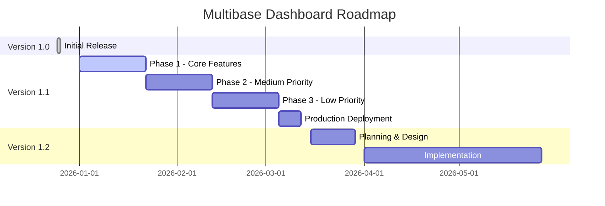

# Multibase Dashboard - Version Overview

**Current State:** December 25, 2025

---

## 📌 Version Overview

### ✅ Version 1.0 - Production (Current State)

**Release:** December 25, 2025  
**Status:** ✅ Stable and production-ready

[📄 Go to Documentation →](./README.md)

**Core Functions:**

- ✅ Authentication & Session Management
- ✅ User CRUD (Admin)
- ✅ Instance Management (Create, Start, Stop, Delete)
- ✅ Real-time Monitoring (Health, Metrics, Logs)
- ✅ Backup & Restore System
- ✅ WebSocket Live Updates
- ✅ Docker Container Integration

---

### 🚧 Version 1.1 - In Planning

**Planned Release:** Q1 2026  
**Status:** 📋 In Planning / Development

[📄 Go to Documentation →](./Readme1_1_feature.md)

**Planned Features:**

- 👥 Extended User Management (2FA, Profiles, Sessions)
- 🔔 Alert System with Notifications
- 💾 Scheduled Backups & Extended Restore Options
- 🔒 Rate Limiting & Input Validation (Zod)
- 📊 Audit Logging & Health Endpoints
- 📦 Instance Templates/Presets
- 🔑 API Key Management
- 🗄️ Database Migrations UI
- 🔄 CI/CD Integration
- 🚀 Production Deployment Guide

**Priorities:**

- **Phase 1 (High):** User Management, Alerts, Backups, Security
- **Phase 2 (Medium):** Templates, API Keys, Audit Logs
- **Phase 3 (Low):** Migrations, CI/CD
- **Phase 4:** Production Deployment

---

### 🔮 Version 1.2 - Future

**Planned Release:** Q2-Q3 2026  
**Status:** 💡 Idea Collection

[📄 Go to Documentation →](./Readme1_2_Feature.md)

**Feature Ideas:**

- 🏢 Multi-Tenancy/Teams
- 💰 Cost Tracking & Billing
- 📊 Advanced Monitoring (Grafana, Prometheus)
- 📦 Instance Cloning & Snapshots
- 📧 Email Service Integration
- 💾 Storage Management
- 🔒 GDPR/Compliance Features

---

## 📋 Migration Path

### v1.0 → v1.1

#### Database Migrations

```prisma
// New Models in v1.1
- User: email, avatar, twoFactorEnabled, twoFactorSecret
- Session: New table for Session Management
- AlertRule: New table
- AlertNotification: New table
- BackupSchedule: New table
- AuditLog: New table
- ApiKey: New table
- InstanceTemplate: New table
```

#### Breaking Changes

- ⚠️ SQLite → PostgreSQL (Production)
- ⚠️ Session-Token Format changed
- ⚠️ API Rate Limiting active (might affect existing API clients)

#### Migration Script

```bash
# Create Backup
npm run backup

# Update Dependencies
npm install

# Prisma Migration
npx prisma migrate dev

# Migrate Data
npm run migrate:v1.0-to-v1.1

# Restart Server
npm run start
```

---

## 🎯 Development Roadmap



---

## 📝 Version History

### v1.0.0 (2025-12-25)

- ✅ Initial Release
- ✅ Basic Authentication
- ✅ Instance Management
- ✅ Backup/Restore
- ✅ Monitoring & Logs

---

## 🔗 Additional Documentation

### General

- [README.md](./README.md) - Version 1.0 (Current State)
- [Readme1_1_feature.md](./Readme1_1_feature.md) - Version 1.1 Features
- [Readme1_2_Feature.md](./Readme1_2_Feature.md) - Version 1.2 Ideas

### Dashboard Specific

- [Dashboard README](../dashboard/README.md) - Technical Documentation
- [DEPLOYMENT.md](../dashboard/DEPLOYMENT.md) - Deployment Guide
- [QUICK_REFERENCE.md](../dashboard/QUICK_REFERENCE.md) - Quick Reference
- [TROUBLESHOOTING.md](../docs/TROUBLESHOOTING.md) - Troubleshooting

### Project Information

- [AWS_DEPLOYMENT.md](../docs/AWS_DEPLOYMENT.md) - AWS Deployment
- [PORT_REFERENCE.md](../docs/PORT_REFERENCE.md) - Port Overview
- [REALTIME_CONFIG.md](../docs/REALTIME_CONFIG.md) - Realtime Config

---

## 👥 Contributing

Suggestions for new features or improvements can be submitted as an Issue or Pull Request.

### Feature Request Process

1. Create Issue with label `feature-request`
2. Discussion & Feedback
3. Prioritization by Maintainer
4. Assignment to Version (1.1, 1.2, etc.)
5. Implementation & Review

---

**Last Update:** December 25, 2025
