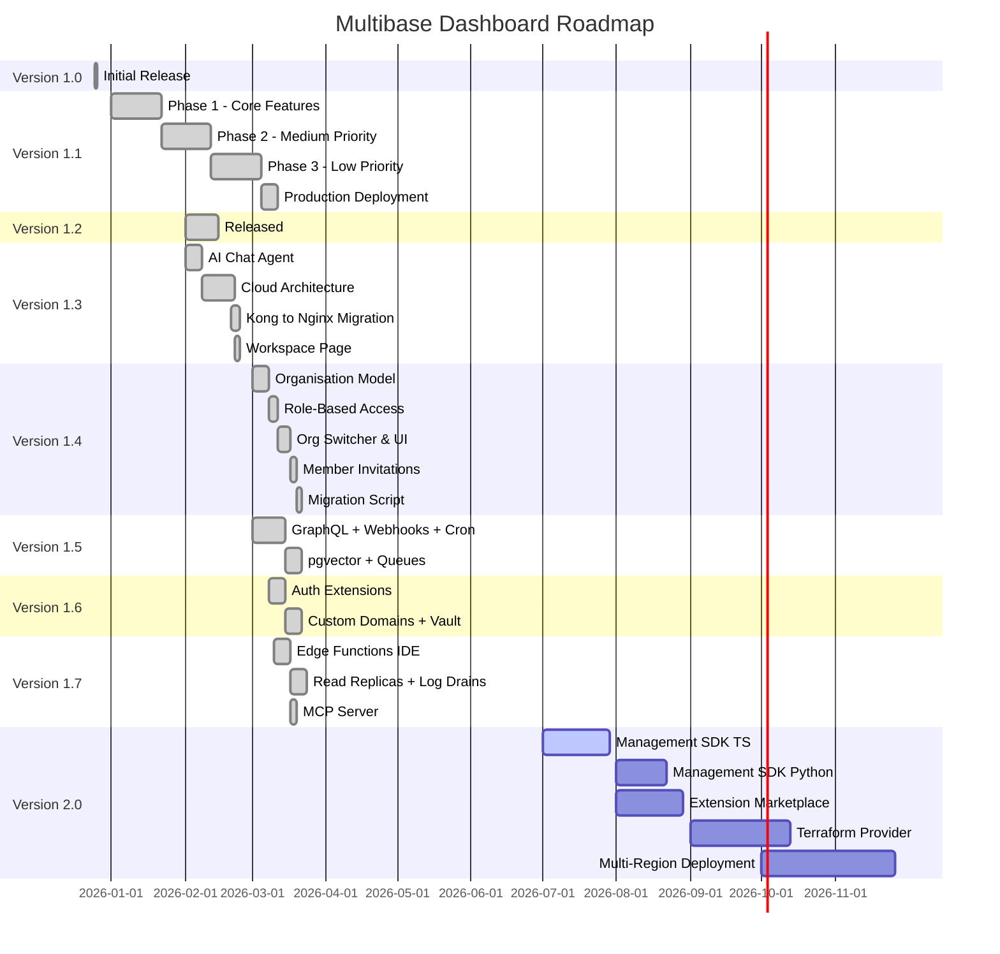

# Multibase Dashboard - Version Overview

**Current State:** December 25, 2025

---

## 📌 Version Overview

### ✅ Version 1.0 - Production (Current State)

**Release:** December 25, 2025  
**Status:** ✅ Stable and production-ready

[📄 Go to Documentation →](./README.md)

**Core Functions:**

- ✅ Authentication & Session Management
- ✅ User CRUD (Admin)
- ✅ Instance Management (Create, Start, Stop, Delete)
- ✅ Real-time Monitoring (Health, Metrics, Logs)
- ✅ Backup & Restore System
- ✅ WebSocket Live Updates
- ✅ Docker Container Integration

---

### ✅ Version 1.1 - Released

**Release:** January 2026  
**Status:** ✅ Released and production-ready

[📄 Go to Documentation →](./Readme1_1_feature.md)

**Implemented Features:**

- ✅ 👥 **Extended User Management** (2FA, Profiles, Sessions)
- ✅ 🔔 **Alert System** with Notifications
- ✅ 💾 **Scheduled Backups** & Extended Restore Options
- ✅ 🔒 **Rate Limiting** & Input Validation (Zod)
- ✅ 📊 **Audit Logging** & Health Endpoints
- ✅ 📦 **Instance Templates/Presets**
- ✅ 🔑 **API Key Management**
- ✅ 🗄️ **Database Migrations UI**
- ✅ 🔄 **CI/CD Integration**
- ✅ 🚀 **Production Deployment Guide**

---

### ✅ Version 1.2 - Released

**Release:** February 2026  
**Status:** ✅ Released and production-ready

[📄 Go to Documentation →](./Readme1_2_Feature.md)

**Implemented Features:**

- ✅ 💾 **Storage Manager Improvements**
  - Folder Management, Image Previews, Signed URLs, Security.
- ✅ 📊 **Advanced Monitoring**
  - Extended metrics and logs.
- ✅ 📦 **Instance Cloning & Snapshots**
  - Duplicate instances and manage state.

---

### ✅ Version 1.3 - Released

**Release:** February 2026  
**Status:** ✅ Released and production-ready

[📄 Go to Documentation →](./Readme1_3_Feature.md)

**Implemented Features:**

- ✅ 🤖 **AI Chat Agent** – Multi-provider LLM assistant with 30+ tools
- ✅ ☁️ **Cloud Architecture** – Shared Infrastructure (8 shared + 5 per-tenant containers)
- ✅ 🔀 **Kong → Nginx Migration** – Single Nginx gateway replacing all per-tenant Kong (~7 GiB RAM saved)
- ✅ 🖥️ **Workspace Page** – Unified project management (Studio, Keys, SMTP, Manager)
- ✅ 📊 **SharedInfra Dashboard** – Resource monitoring with GaugeCharts for CPU/RAM

> Multi-Tenancy & Organisations continued in [Version 1.4](./Readme1_4_Feature.md).

---

### ✅ Version 1.4 — Multi-Tenancy & Organisations

**Release:** March 2026  
**Status:** ✅ Released and production-ready

[📄 Go to Documentation →](./Readme1_4_Feature.md)  
[📖 User Guide →](../docs/MULTI_TENANCY.md)

**Implemented Features:**

- ✅ 🏢 **Organisation Model** — Create/manage named organisations at registration
- ✅ 👥 **Role-Based Access** — `owner`, `admin`, `member`, `viewer` per org
- ✅ 🔀 **Org Switcher** — GitHub-style navbar dropdown for multi-org users
- ✅ 🔒 **Instance Isolation** — Middleware-level org-scoping for all API routes
- ✅ ✉️ **Member Invitations** — Invite by email with selectable role
- ✅ 🛠️ **Migration Script** — `scripts/migrate-v1.3-to-v1.4.js` auto-migrates existing data

---

### ✅ Versions 1.5–1.7 — Released

| Version | Release | Key Features |
|---------|---------|--------------|
| **v1.5** | March 2026 | GraphQL Playground, DB Webhooks, Cron Manager, pgvector, Message Queues |
| **v1.6** | March 2026 | Auth Extensions, Custom Domains, Vault Secrets, Network Restrictions, Tus Uploads |
| **v1.7** | March 2026 | Edge Functions IDE, Read Replicas, Log Drains, Realtime Dashboard, MCP Server |

---

### 🚧 Version 2.0 — In Planning

**Planned Release:** Q3 2026  
**Status:** 📋 In Planning

[📄 Go to Documentation →](./Readme2_0_Feature.md)

**Planned Features:**

- ⬜ 🏗️ **Terraform Provider** — Infrastructure-as-Code for Multibase instances, orgs, API keys
- ⬜ 🛠️ **Management SDK TypeScript** — `@multibase/sdk` on npm with full API coverage
- ⬜ 🐍 **Management SDK Python** — `multibase-sdk` on PyPI with async support
- ⬜ 🧩 **Extension Marketplace** — One-click install of DB templates, Edge Functions, Auth configs
- ⬜ 🌍 **Multi-Region Deployment** — Deploy instances across geographic regions with geo-routing

**CLI Status:**

> ✅ **Already implemented** — `supabase_manager.py` is a custom Python 3 CLI (519 lines).  
> It is **not** part of the Supabase stack — it was built specifically for Multibase multi-tenant management.

---

## 📋 Migration Path

### v1.0 → v1.1

#### Database Migrations

```prisma
// New Models in v1.1
- User: email, avatar, twoFactorEnabled, twoFactorSecret
- Session: New table for Session Management
- AlertRule: New table
- AlertNotification: New table
- BackupSchedule: New table
- AuditLog: New table
- ApiKey: New table
- InstanceTemplate: New table
```

#### Breaking Changes

- ⚠️ SQLite → PostgreSQL (Production)
- ⚠️ Session-Token Format changed
- ⚠️ API Rate Limiting active (might affect existing API clients)

#### Migration Script

```bash
# Create Backup
npm run backup

# Update Dependencies
npm install

# Prisma Migration
npx prisma migrate dev

# Migrate Data
npm run migrate:v1.0-to-v1.1

# Restart Server
npm run start
```

---

## 🎯 Development Roadmap


```mermaid
gantt
    title Multibase Dashboard Roadmap
    dateFormat YYYY-MM-DD
    section Version 1.0
    Initial Release           :done, 2025-12-25, 1d
    section Version 1.1
    Phase 1 - Core Features     :done, 2026-01-01, 3w
    Phase 2 - Medium Priority   :done, 2026-01-22, 3w
    Phase 3 - Low Priority      :done, 2026-02-12, 3w
    Production Deployment       :done, 2026-03-05, 1w
    section Version 1.2
    Released                    :done, 2026-02-01, 2w
    section Version 1.3
    AI Chat Agent               :done, 2026-02-01, 1w
    Cloud Architecture          :done, 2026-02-08, 2w
    Kong to Nginx Migration     :done, 2026-02-20, 4d
    Workspace Page              :done, 2026-02-22, 2d
    section Version 1.4
    Organisation Model          :done, 2026-03-01, 1w
    Role-Based Access           :done, 2026-03-08, 4d
    Org Switcher & UI           :done, 2026-03-12, 5d
    Member Invitations          :done, 2026-03-17, 3d
    Migration Script            :done, 2026-03-20, 2d
    section Version 1.5
    GraphQL + Webhooks + Cron   :done, 2026-03-01, 2w
    pgvector + Queues           :done, 2026-03-15, 1w
    section Version 1.6
    Auth Extensions             :done, 2026-03-08, 1w
    Custom Domains + Vault      :done, 2026-03-15, 1w
    section Version 1.7
    Edge Functions IDE          :done, 2026-03-10, 1w
    Read Replicas + Log Drains  :done, 2026-03-17, 1w
    MCP Server                  :done, 2026-03-17, 3d
    section Version 2.0
    Management SDK TS           :active, 2026-07-01, 4w
    Management SDK Python       :2026-08-01, 3w
    Extension Marketplace       :2026-08-01, 4w
    Terraform Provider          :2026-09-01, 6w
    Multi-Region Deployment     :2026-10-01, 8w
```

---

## 📝 Version History

### v2.0.0 (Planned Q3 2026)

- ⬜ Terraform Provider (HCL, Terraform Registry)
- ⬜ Management SDK TypeScript (`@multibase/sdk` on npm)
- ⬜ Management SDK Python (`multibase-sdk` on PyPI)
- ⬜ Extension Marketplace (one-click install)
- ⬜ Multi-Region Deployment (geo-routing, failover)

### v1.7.0 (March 2026)

- ✅ Edge Functions IDE (CodeMirror 6, TypeScript, Env Vars, Test Runner)
- ✅ Read Replicas (external PostgreSQL registration, status monitor, lag display)
- ✅ Log Drains (webhook export, json/ndjson/logfmt, 30s polling)
- ✅ Realtime Dashboard (channels, presence, concurrent users config)
- ✅ MCP Server (12 tools, JSON-RPC 2.0, Claude Desktop/Cursor/VS Code)

### v1.6.0 (March 2026)

- ✅ Auth Tab in Workspace + Auth Extensions (Phone/CAPTCHA/SAML/Templates)
- ✅ Custom Domains per tenant (DNS-CNAME check + Certbot SSL + Nginx config)
- ✅ Environment Labels (production/staging/dev/preview) + Clone Shortcuts
- ✅ Storage: Tus Resumable Uploads + Nginx CDN Cache
- ✅ Vault Secrets UI (pgsodium/pg_vault)
- ✅ Network Restrictions (IP Whitelist, SSL enforcement, rate limiting)

### v1.5.0 (March 2026)

- ✅ GraphQL API Playground (pg_graphql)
- ✅ Database Webhooks (pg_net)
- ✅ Cron Job Manager (pg_cron)
- ✅ AI & Vectors (pgvector — collections, embeddings, similarity search)
- ✅ Message Queues (pgmq)
- ✅ Workspace Redesign (3-level navigation)

### v1.4.0 (March 2026)

- ✅ Multi-Tenancy: Organisation model with owner/admin/member/viewer roles
- ✅ Org Switcher in navbar (multi-org support)
- ✅ Member invitation system (email + role)
- ✅ Middleware-level instance isolation per org
- ✅ Migration script: v1.3 → v1.4 (auto-creates default org for existing data)

### v1.3.0 (2026-02-24)

- ✅ AI Chat Agent (multi-provider, 30+ tools, SSE streaming)
- ✅ Cloud Architecture: Shared Infrastructure (8 containers)
- ✅ Kong→Nginx Migration (~7 GiB RAM saved)
- ✅ Workspace Page (Studio, Keys, SMTP, Manager)
- ✅ SharedInfra Dashboard (GaugeCharts, 8 services)
- ✅ Nginx Gateway auto-config on `setup_shared.py start`

### v1.2.0 (2026-02)

- ✅ Storage Manager, Advanced Monitoring, Instance Cloning

### v1.1.0 (2026-01)

- ✅ User Management, Alerts, Backups, Security, Templates

### v1.0.0 (2025-12-25)

- ✅ Initial Release
- ✅ Basic Authentication
- ✅ Instance Management
- ✅ Backup/Restore
- ✅ Monitoring & Logs

---

## 🔗 Additional Documentation

### General

- [README.md](./README.md) - Version 1.0 (Current State)
- [Readme1_1_feature.md](./Readme1_1_feature.md) - Version 1.1 Features
- [Readme1_2_Feature.md](./Readme1_2_Feature.md) - Version 1.2 Features
- [Readme1_3_Feature.md](./Readme1_3_Feature.md) - Version 1.3 Features
- [Readme1_4_Feature.md](./Readme1_4_Feature.md) - Version 1.4 Features (Multi-Tenancy)
- [Readme1_5_Feature.md](./Readme1_5_Feature.md) - Version 1.5 Features
- [Readme1_6_Feature.md](./Readme1_6_Feature.md) - Version 1.6 Features
- [Readme1_7_Feature.md](./Readme1_7_Feature.md) - Version 1.7 Features
- [Readme2_0_Feature.md](./Readme2_0_Feature.md) - Version 2.0 Feature Plan (In Planning)
- [MULTI_TENANCY.md](../docs/MULTI_TENANCY.md) - Multi-Tenancy User Guide
- [CLOUD_ARCHITECTURE.md](./CLOUD_ARCHITECTURE.md) - Cloud Architecture Implementation Log
- [KONG_NGINX_MIGRATION.md](./KONG_NGINX_MIGRATION.md) - Kong→Nginx Migration Reference

### Dashboard Specific

- [Dashboard README](../dashboard/README.md) - Technical Documentation
- [DEPLOYMENT.md](../dashboard/DEPLOYMENT.md) - Deployment Guide
- [QUICK_REFERENCE.md](../dashboard/QUICK_REFERENCE.md) - Quick Reference
- [TROUBLESHOOTING.md](../docs/TROUBLESHOOTING.md) - Troubleshooting

### Project Information

- [AWS_DEPLOYMENT.md](../docs/AWS_DEPLOYMENT.md) - AWS Deployment
- [PORT_REFERENCE.md](../docs/PORT_REFERENCE.md) - Port Overview
- [REALTIME_CONFIG.md](../docs/REALTIME_CONFIG.md) - Realtime Config

---

## 👥 Contributing

Suggestions for new features or improvements can be submitted as an Issue or Pull Request.

### Feature Request Process

1. Create Issue with label `feature-request`
2. Discussion & Feedback
3. Prioritization by Maintainer
4. Assignment to Version (1.1, 1.2, etc.)
5. Implementation & Review

---

**Last Update:** March 2026 (v2.0 plan added)
